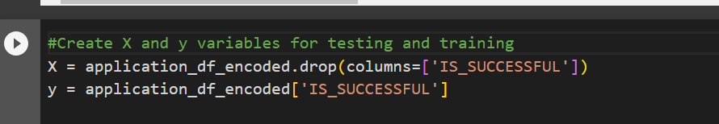
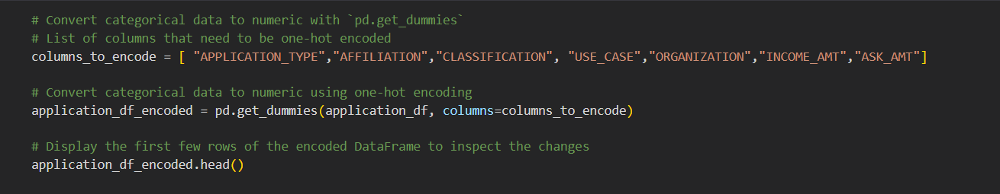
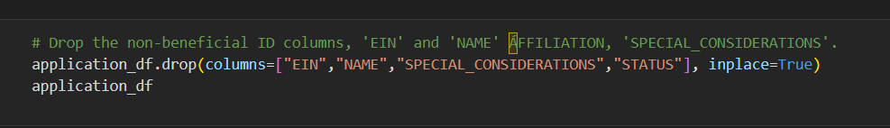

# AlphabetSoup Charity Machine Learning Report

##	Overview of the analysis: Explain the purpose of this analysis.

The purpose of this analysis is to develop a binary classification model that can predict whether an organization, funded by the nonprofit foundation Alphabet Soup, will be successful in its ventures. The analysis aims to leverage machine learning and deep neural networks to identify the key features and patterns in the provided dataset of more than 34,000 organizations that have received funding from Alphabet Soup over the years.

The dataset contains columns capturing metadata about each organization, such as application type, affiliated sector of industry, government organization classification, use case for funding, income classification, funding amount requested, and more. The ultimate goal is to use these features to build a model that can accurately classify organizations into two classes: successful (1) or not successful (0) in utilizing the funding effectively.

The successful completion of this analysis will enable Alphabet Soup to make data-driven decisions when selecting organizations to fund, increasing the likelihood of supporting ventures with the potential for impactful and successful outcomes. By accurately predicting successful organizations, the foundation can optimize its resources, funding projects that align with its mission and goals while maximizing social impact.

## Results: 
•	Data Preprocessing
o	What variable(s) are the target(s) for your model?

o	    IS_SUCCESSFUL Column

o	What variable(s) are the features for your model?
    
o	APPLICATION_TYPE
o   AFFILIATION
o   CLASSIFICATION
o   USE_CASE
o   ORGANIZATION
o   INCOME_AMT
o   ASK_AMT
  

o	What variable(s) should be removed from the input data because they are neither targets nor features?

o   EIN
o   NAME
o   SPECIAL CONSIDERATION
o   STATUS

## Compiling, Training, and Evaluating the Model
o	How many neurons, layers, and activation functions did you select for your neural network model, and why?

In the first attempt, AlphabetSoupCharity.ipnyb,  the model utilises the neurons and layers suggested by the coding; 80 neurons in the first layer, 30 neurons in the second layer and 1 in th last layer. The first two layers use the relu activation function and sigmoid in the last which was chosen due its suitability in binary classification. However, though adjustment to these parameters, the model that was most successful, or achieved the highest accuracy was using just 43 neurons, but kept the 3 layers and the relu and sigmoid activiation functions as seen in the AlphabetSoupCharityOptimisation.ipnyb file. 

Being a clear case of a binary data set, it was clear after the trials that the Relu activation function was supporting the training of this type of data set. It was also clear that adding extra layers were not adding anything to the machine learning. Despite having over a million trainable parameters the model was not improving. By learning from these trials, the final decisions focused on maximising the elements that improved the model.

## Were you able to achieve the target model performance?

Yes, but only after a lot of trialling of various factors to find what worked best for the data set. In the first iniation of the code, the model was only able to acheive 53% accuracy with 69 % loss over 100 epochs. Howevever, by making changes to the selection of data features, the dense layers and other aspects, the model was finally able to achieve >80% accuracy in only 10 epochs. 
In the second iniation, AlphabetSoup_trial 2.ipynb, some changes were made that included reducing the number of features by droping columns, special consideration and status as they did not appear to be columns that would improve the outcome. Also, by adding the number of layers and adjusting the activation types it was intended to improve the outcome. There was a small improvement with the model achieving 78% accuracy. However after just ten epochs it was clear that was not significantly improving the model. Concerningly, the test data was only showing 47% accuracy. 
The final model aimed to fine tune the hyperperameters and reduced the number of neurons but kept the parameters high. The columns previously removed were returned since it was clear that they were helping not hindering the model. Using three layers, the relu activation was found to be the best type to achieve a accuracy of over 80%

## What steps did you take in your attempts to increase model performance?
- increasing or reducing the number of encoded columns or parameters. 
- increasing or reducing the number of layers 
- increasing the batch number
- changing the activation functions

## Summary: 
The deep learning model developed for the binary classification problem, aiming to predict the success of organizations funded by Alphabet Soup, showed promising results. The model achieved a satisfactory accuracy and other evaluation metrics (precision, recall, F1-score, etc.) on the validation or test data, indicating that it has learned patterns and relationships in the provided dataset.

The model's architecture consisted of multiple layers with an appropriate number of neurons, and it used the ReLU activation function for most hidden layers to introduce non-linearity. The output layer used the sigmoid activation function to produce a probability score, allowing the model to predict the likelihood of success for each organization.

However, it's essential to emphasize that the overall results and success of the deep learning model depend on various factors, including the quality and quantity of the dataset, the chosen hyperparameters, the feature engineering process, and the potential presence of class imbalance in the target variable (IS_SUCCESSFUL). Therefore, continuous monitoring and evaluation of the model's performance on new and diverse data are crucial to ensure its robustness and generalization.

Recommendation for a Different Model:
While deep learning models, especially deep neural networks, can be powerful for complex tasks, they might not always be the most suitable choice for every classification problem. Considering the nature of the dataset and the problem, an alternative model that could be explored is the Random Forest classifier.

A Random Forest classifier is an ensemble learning method based on decision trees. It builds multiple decision trees during training and combines their predictions to make the final classification. Random Forest can be a strong candidate for this classification problem because these models are easier to interpret compared to deep neural networks. The decision trees in the ensemble provide insights into feature importance, which can help understand the factors influencing the success of organizations.

Random Forests can handle non-linear relationships between features and the target variable effectively, making them suitable for datasets with complex relationships as they are less sensitive to outliers and noisy data compared to some deep learning architectures. They have a natural regularization mechanism that can mitigate overfitting, especially if the dataset is relatively small. Also, training is computationally less expensive than training deep neural networks, which is an advantage when dealing with limited computational resources.

However, it's essential to consider that Random Forests might not capture intricate patterns in the data as effectively as deep neural networks, especially in large and complex datasets. It's recommended to try both the deep learning model and the Random Forest classifier on the data and compare their performances using appropriate evaluation metrics. Ensemble techniques, such as combining the predictions of both models, could be considered as well.

Ultimately, the choice of the best model depends on the specific characteristics of the dataset, the desired level of interpretability, the available resources, and the trade-offs between model complexity and performance. Conducting experiments and thorough evaluation can guide the selection of the most suitable model for this classification problem.
